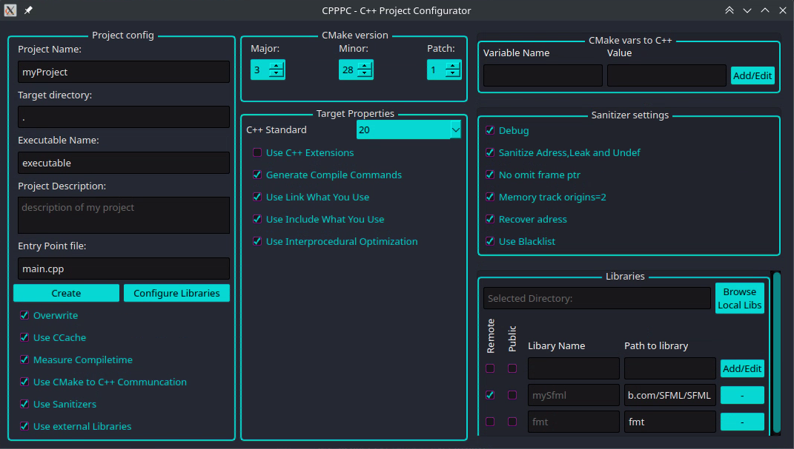

# CPPPC - C++ Project Configurator
[comment]: <> (Simple GUI application written in Python aimed at setting up CMake based C++ Projects.)
CPPPC is a GUI tool designed to generate boilerplate projects for C++. It utilizes Python to generate a CMakeLists.txt file along with a directory structure. The primary goal of CPPPC is to be flexible in generating various types of C++ projects (Libraries, Executables) while remaining easy to extend.



## Project Status
Currently, CPPPC is in a very early build stage. It can generate a directory structure and create a CMakeLists.txt file for an executable project based on settings provided through the GUI.

## Upcoming Features

CPPPC currently under development, upcoming features include:

- Adding projects from GitHub and other services to be imported as libraries.
- Generating IDE-specific files, such as workspace files for Visual Studio Code.
- Crossplatform support (Currently only tested on Linux)
- and more...

## Precompiled binaries 
The easiest way to run the application is with the precompiled binaries from the [Releases page](https://github.com/lr222gw/cpppc/releases).

Alternatively, you can follow the steps below to run the sourcecode!

## Prerequisites

Before using CPPPC, make sure you have the following installed:

- [cmake](https://cmake.org/)
- [python](https://www.python.org/)
- [PyQt5](https://riverbankcomputing.com/software/pyqt/) (GUI library) 

## Getting Started

To use CPPPC, follow these steps:

1. Install the required prerequisites.

    [Details of prerequisites installation can be found here](docs/REQUIREMENTS.md)

2. Clone the repository:

    ```bash
    git clone https://github.com/your-username/CPPPC.git
    ```

3. Navigate to the project directory:

    ```bash
    cd CPPPC
    ```

4. Run the CPPPC tool:

    ```bash
    python cpppc.py
    ```


